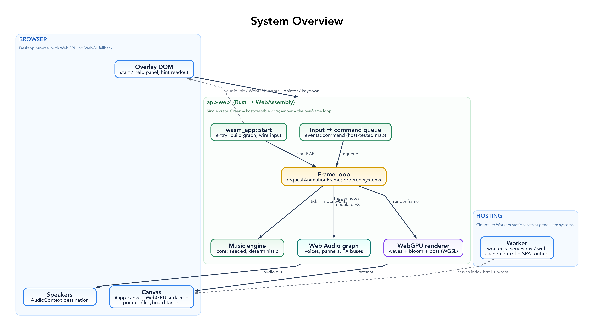
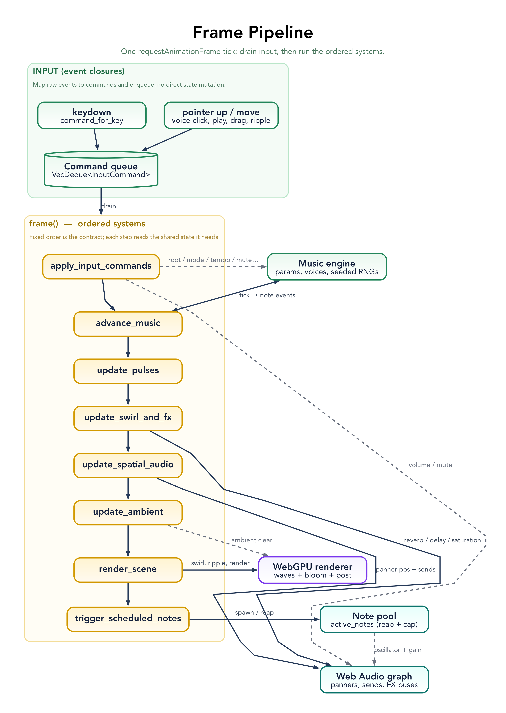

# Architecture Guide

This document explains how Geno-1's code is organized and the set of patterns that explain most of
it. For *what* the system does and the audio/visual pipelines, see [`SPEC.md`](SPEC.md).

## System Overview

Geno-1 is a single Rust crate (`app-web`) compiled to WebAssembly. A `requestAnimationFrame` loop
([`frame.rs`](../src/frame.rs)) drains a shared input queue, advances a deterministic music engine,
synthesises new notes through a Web Audio graph, modulates global effects from pointer gestures,
updates per-voice spatial audio, and renders an audio-reactive wave field with WebGPU. The core logic
(engine, key maps, picking, the key→command mapping) is plain host-testable Rust; everything
browser-facing is gated to the wasm target.

_Diagrams (Graphviz sources + rendered PNGs) live in [diagrams/](diagrams/README.md)._

## Core Patterns

Geno-1 is small, but it leans on a consistent set of patterns. Knowing these explains most of the
code, and new code should fit one of them rather than inventing a parallel mechanism.

### The engine core (`core/`, `input`, `events::keymap`, `events::command`)

- **Host-testable core, wasm-gated shell.** [`lib.rs`](../src/lib.rs) exports `core`, `events`, and
  `input` unconditionally and gates everything browser-facing (`audio`, `render`, `frame`, `wasm_app`,
  `constants`, …) behind `#[cfg(target_arch = "wasm32")]`. Pure logic — the music engine, key tables,
  ray-picking, the key→command map — compiles and is unit-tested on the host; Web Audio / WebGPU / DOM
  code never leaks into it. **New logic that can be expressed without the browser belongs here so it
  stays testable.**
- **Strongly-typed domain units.** [`units.rs`](../src/core/units.rs) wraps the domain's numbers in
  `Copy` newtypes — `MidiNote`, `Hz`, `Cents`, `Bpm`, `VoiceIndex` — so a frequency can't be passed
  where a note is expected and a voice index can't be confused with any other `usize`. Domain rules
  (clamps, `MidiNote::to_hz`, `Bpm::eighth_step_seconds`) live on the types, applied uniformly.
- **Deterministic, seeded engine.** [`MusicEngine`](../src/core/music.rs) owns per-voice `StdRng`s
  plus one `aux_rng`, all derived from a single base seed by hash-mixing, so a seed reproduces the
  music and every randomized action — including the `T` key (`randomize_root_and_mode`) — is
  deterministic and host-testable. No wall-clock, no I/O in the engine.
- **Fixed-timestep accumulator.** [`MusicEngine::tick(dt)`](../src/core/music.rs) advances
  `beat_accum += dt` and drains it in fixed eighth-note `step`s (`while beat_accum >= step`), so
  scheduling is frame-rate independent and reproducible. The host owns the clock and feeds elapsed `dt`.
- **Plain structs, not an ECS.** The voice set is tiny and fixed, so the engine holds `Vec<VoiceState>`
  + `Vec<VoiceConfig>` as plain fields and iterates them in `schedule_step`.
- **Pure functions for math/lookup.** [`midi_to_hz`](../src/core/music.rs),
  [`ray_sphere` / `nearest_index_by_uvx`](../src/input.rs), [`screen_to_world_ray`](../src/camera.rs),
  [`root_midi_for_key` / `mode_scale_for_digit`](../src/events/keymap.rs), and
  [`command_for_key`](../src/events/command.rs) are pure; the 33 host tests target exactly these.

### Input

- **Pure key→command mapping.** [`command_for_key`](../src/events/command.rs) maps a key (+ shift) to
  an `InputCommand` with no side effects, so it is host-tested. The keyboard closure
  ([`keyboard.rs`](../src/events/keyboard.rs)) is a thin shell: map the key, enqueue the command,
  `preventDefault` if needed. There is exactly one `window` `keydown` listener — the help toggle is a
  normal command, not a separate listener.
- **One input command queue.** All *discrete* intents — every keyboard action plus voice
  mute/solo/reseed, click-to-play, and ripples — are pushed as [`InputCommand`](../src/events/command.rs)
  values onto a shared `VecDeque`. The frame loop drains it in one place
  ([`FrameContext::apply_input_commands`](../src/frame.rs)); event closures never mutate engine, audio,
  or UI state directly. **New input sources (touch, MIDI) should enqueue commands, not reach into state.**

### The frame loop (`frame.rs`)

- **Named, ordered systems.** [`FrameContext::frame`](../src/frame.rs) is an explicit pipeline of named
  methods run in a fixed order: `apply_input_commands` → `advance_music` → `update_pulses` →
  `update_swirl_and_fx` → `update_spatial_audio` → `update_ambient` → `render_scene` →
  `trigger_scheduled_notes`. The ordering is the contract; each system reads the shared state it needs.
- **Interior mutability with scoped borrows.** Shared state (`engine`, `paused`, `input_queue`,
  `pulses`, `hover_index`, `drag_state`) is `Rc<RefCell<_>>` shared between the RAF loop and the event
  closures. Borrows are deliberately scoped and dropped before re-borrowing or calling out — the
  single-threaded discipline that keeps `RefCell` from panicking.

### WASM runtime & shared state

- **`wasm-bindgen` facade.** [`wasm_app::start`](../src/wasm_app.rs) is the only `#[wasm_bindgen(start)]`
  surface; it builds the graph and hands off to the frame loop. JS holds no application state.
- **Aggregate / parameter-object structs.** Per-frame state and resources are bundled into one
  [`FrameContext`](../src/frame.rs); likewise [`FxBuses` / `VoiceRouting`](../src/audio.rs) and
  [`InputWiring`](../src/events/pointer.rs). One struct in, one `frame()` method out.
- **Closure-and-`forget` event wiring.** Every listener follows `Closure::wrap(Box::new(move |ev| …))`
  → `add_event_listener_with_callback` → `closure.forget()` for a `'static` lifetime; the RAF loop is a
  self-rescheduling `Rc<RefCell<Option<Closure>>>` ([`start_loop`](../src/frame.rs)).
- **Optional subsystems degrade gracefully.** `gpu: Option<GpuState>` and `analyser: Option<AnalyserNode>`
  let the app run (and the headless test pass) without WebGPU or an analyser; [`init_gpu`](../src/frame.rs)
  returns `None` and surfaces a DOM message instead of panicking.
- **Once-guard and module singletons.** A `static STARTED: AtomicBool` guards one-time init; a
  `thread_local! MASTER_UNMUTED_GAIN` in [`audio.rs`](../src/audio.rs) remembers the pre-mute gain.

### Audio graph (`audio.rs`)

See the [audio graph diagram](diagrams/audio-graph.png) for the full signal flow.

- **Construction via factories returning bundle structs.** [`build_fx_buses`](../src/audio.rs) →
  `FxBuses`, [`wire_voices`](../src/audio.rs) → `VoiceRouting`, and [`create_analyser`](../src/audio.rs)
  build the Web Audio graph once and return a struct of the nodes the frame loop later modulates.
- **Fire-and-forget JS calls (`_ = …`).** Node `connect` / `set_value` / ramp calls return `Result`s
  whose failure is non-fatal; they are discarded with `_ = …`, reserving real handling for construction.
- **Errors as `anyhow` at construction boundaries.** The `build_*` / `wire_*` factories and `init()`
  all use `anyhow::Result` + `?`, carrying the failing node's name; init shows a user-facing DOM
  message on failure. Per-frame code never returns `Result`.
- **Bounded note pool.** [`trigger_one_shot`](../src/audio.rs) returns the `ActiveNote` (oscillator +
  gain + stop time) it creates. The frame loop ([`spawn_note`](../src/frame.rs)) tracks live notes,
  disconnects any whose stop time has passed, and caps concurrency at `MAX_POLYPHONY`, so node lifetime
  is bounded and explicit rather than left to the GC.

### Rendering (`render/`)

See the [render pipeline diagram](diagrams/render-pipeline.png) for the passes.

- **Resource-bundle structs + factories** (the GPU mirror of the audio side):
  [`WavesResources` / `create_waves_resources`](../src/render/waves.rs), `PostResources`,
  `RenderTargets`, with shared builders [`create_color_texture` / `make_post_pipeline`](../src/render/helpers.rs).
- **`#[repr(C)]` Pod uniforms.** GPU-facing data is `bytemuck::Pod` / `Zeroable` (`WavesUniforms`,
  `VoicePacked`) uploaded straight to uniform buffers ([`waves.rs`](../src/render/waves.rs)).
- **Ping-pong offscreen targets.** Bloom runs HDR → half-res `bloom_a` / `bloom_b` ping-pong, recreated
  on resize (`RenderTargets`). The full pass list is in [`SPEC.md`](SPEC.md).

### Tuning

- **Const defaults, runtime `Config`.** [`constants.rs`](../src/constants.rs) holds the named tuning
  values as the compile-time defaults. The interactive-feel subset (inertial swirl, swirl energy, and
  the global FX it drives) is mirrored into a cloneable [`Config`](../src/constants.rs) seeded from
  those consts via `Default`; the frame holds one `Config` and the swirl/FX systems read it, so a preset
  or live-tuning layer can vary the feel without a rebuild. Structural constants (camera, picking,
  bloom, click-to-note mapping) stay compile-time.

## Intentional Boundaries

Deliberate choices, so they are not mistaken for missing patterns:

- **Continuous manipulation stays frame-coupled.** Voice drag (`pointermove` → `set_voice_position`)
  and the pointer swirl are continuous, per-frame manipulations rather than discrete intents, so they
  update state directly instead of going through the command queue.
- **Click-to-note mapping is computed in the handler.** The pointer handler converts a tap into a
  pitch/velocity/duration and the nearest voice, then enqueues a `PlayNote` command — the *mapping*
  (which reads voice positions) is local; the *effect* still flows through the queue.

## Future Directions

Patterns worth extending (see [`TODO.md`](TODO.md) for the full backlog):

- Extend `Config` to the remaining tuning groups (sends, pulse, analyser, render strength) and add a
  preset/serialization layer on top of it.
- Capture/restore engine + RNG state for deterministic session replay.
- Route future input sources (touch, MIDI) through `InputCommand` rather than new listeners.

## Codebase Map

| Module | Path | Role | Host-testable |
| --- | --- | --- | --- |
| **core** | [`src/core/`](../src/core/) | Generative engine, scales, seeded scheduling, and domain units (`units.rs`). The heart. | ✅ |
| **input** | [`src/input.rs`](../src/input.rs) | Pure picking math (`ray_sphere`, nearest-by-UV) + pointer state. | ✅ |
| **events** | [`src/events/`](../src/events/) | `keymap` + `command` (pure, tested) and `keyboard`/`pointer` (thin wasm handlers that enqueue commands). | partial |
| **audio** | [`src/audio.rs`](../src/audio.rs) | Web Audio graph construction, per-voice routing, and one-shot note nodes. | wasm-only |
| **render** | [`src/render.rs`](../src/render.rs), [`src/render/`](../src/render/) | WebGPU pipelines: waves, bloom, post, targets. | wasm-only |
| **frame** | [`src/frame.rs`](../src/frame.rs) | RAF loop, ordered per-frame systems, command application, note pool. | wasm-only |
| **wasm_app** | [`src/wasm_app.rs`](../src/wasm_app.rs) | `#[wasm_bindgen(start)]` entry; builds the graph, wires input, starts the loop. | wasm-only |
| **constants** | [`src/constants.rs`](../src/constants.rs) | Tuning constants and the runtime `Config`. | wasm-only |
| **dom / overlay / camera** | [`src/`](../src/) | Canvas sizing, hint/help overlay, view math. | mixed |
