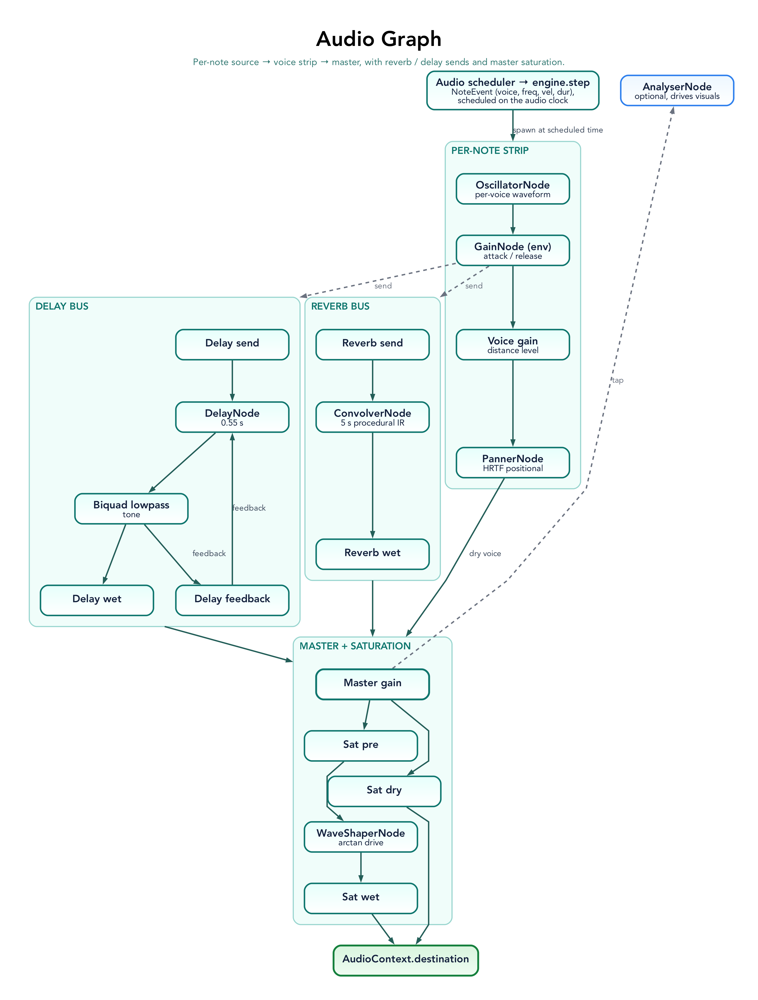
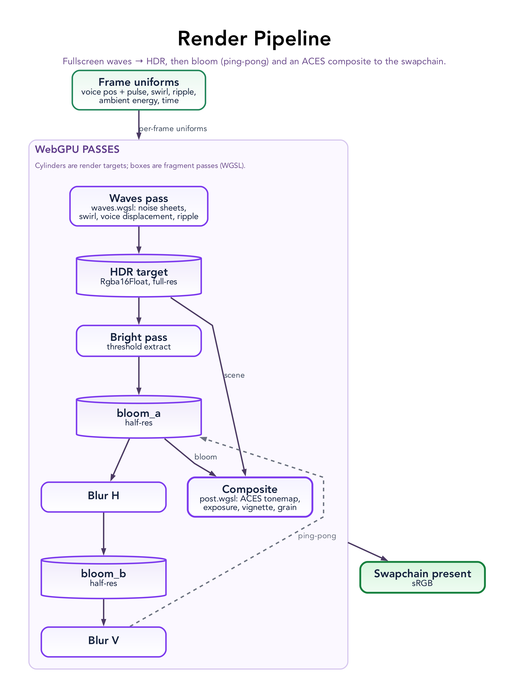

# Geno-1 – System Specification

Geno-1 is an interactive generative music visualizer built with Rust, WebAssembly, and WebGPU.
It generates evolving polyphonic music algorithmically, arranges the voices in a virtual 3D space
for spatial audio, and renders an ambient wave field that reacts to the music and to pointer
gestures. The target platform is desktop web browsers with WebGPU; there is no WebGL fallback, and
mobile is not a focus.

This document describes how the system is built. For the code-level patterns and module map see
[`ARCHITECTURE.md`](ARCHITECTURE.md); the backlog of intended work lives in [`TODO.md`](TODO.md).

## Capabilities

**Audio**

- Three generative voices (sine / saw / triangle) with per-voice trigger probability, octave offset,
  and note duration.
- Scale-constrained pitches: `A`–`G` roots, seven diatonic modes, and a C major pentatonic default.
- Microtonality: global detune in cents (±200¢) and 19-TET / 24-TET / 31-TET pentatonic tunings.
- Eighth-note grid scheduler with per-voice RNG seeding; `R` reseeds all voices, `T` randomises root + mode.
- Web Audio graph: per-note `OscillatorNode` → envelope `GainNode` → voice `GainNode` → `PannerNode`,
  into a master bus with convolution reverb, a dark feedback delay, and saturation.
- Gesture-based audio unlock via the Start overlay; pause/resume, tempo, and volume from the keyboard.

**Visuals**

- Ambient wave field with voice-reactive displacement and proximity highlights.
- Pointer-driven swirl distortion with inertial physics and exponential falloff.
- Click ripple propagation.
- HDR post-processing: bright pass, separable blur, ACES tonemap, vignette, and film grain.
- Voice repositioning by drag, with matching spatial-audio response.

**Interaction**

- Keyboard control surface (see [`README.md`](../README.md) for the full map).
- Voice interaction: click (mute), `Alt`+click (solo), `Shift`+click (reseed), drag (spatial position).
- A hint overlay showing live BPM, detune, and scale; fullscreen toggle with canvas rescaling.

## Technical Stack and Constraints

- **Rust + WebAssembly:** the application is a single `app-web` crate compiled to wasm via `wasm-pack`,
  with an internal `src/core` module for host-testable logic (engine, keymap, picking).
- **WebGPU via `wgpu`:** all rendering uses WebGPU through the `wgpu` crate. The "window" is an HTML
  `<canvas>` with a WebGPU surface. WebGL is intentionally not supported.
- **Web Audio:** synthesis and output use the Web Audio API through `web-sys`. A lookahead scheduler on
  a `setInterval` advances generation and schedules notes ahead on the `AudioContext` clock — off the
  render frame, so timing does not depend on the frame rate.
- **No game engine:** graphics use `wgpu` with `glam` for math; randomness uses `rand`. Core logic is custom.
- **Browser support:** Chrome / Edge 113+ with WebGPU enabled. A Start overlay handles the audio
  gesture unlock; a missing-WebGPU message is shown when `navigator.gpu` is absent.

## System Architecture

The system has three subsystems that share memory in a single WASM module, driven by two loops:

1. **Audio engine** — generates note events and renders sound with spatial effects.
2. **Visual engine** — renders the wave field and post-processing stack with WebGPU.
3. **Interaction module** — translates keyboard and pointer input into engine and audio changes.

A lookahead scheduler (`src/scheduler.rs`) on a `setInterval` advances the engine one grid step at a
time and schedules notes ahead on the `AudioContext` clock. A `requestAnimationFrame` loop
(`src/frame.rs`) applies queued input, modulates the global FX from pointer "swirl" energy, updates
per-voice spatialisation, and renders a frame. The scheduler hands the frame a queue of timed visual
pulses, so the visuals react — in sync — to the same notes that produce sound.

### Audio Engine

The audio engine produces continuous music from three voices with distinct timbres and roles
(bass / mid / high). It generates notes procedurally rather than playing recordings. Each note event
carries voice, frequency, velocity, start time, and duration.

_Source: [`diagrams/audio-graph.dot`](diagrams/audio-graph.dot) — see [diagrams/](diagrams/README.md)._

Key behaviours:

- **Generation:** on each eighth-note grid step the scheduler advances every voice; a voice may play a
  scale-constrained note based on its trigger probability and octave offset. Reseeding produces new
  per-voice sequences so the music keeps evolving.
- **Synthesis:** each note creates an `OscillatorNode` of the voice's waveform, shaped by a `GainNode`
  attack/release envelope to avoid clicks.
- **Spatial audio:** each voice has a `PannerNode` with HRTF panning; the `AudioListener` is tied to the
  camera. Dragging a voice updates its panner position in real time, and its reverb/delay send levels
  scale with distance.
- **Master bus:** a convolution reverb (procedural impulse), a feedback delay with lowpass tone shaping,
  and an arctan `WaveShaperNode` saturation, mixed wet/dry. Pointer swirl energy modulates reverb,
  delay, and saturation amounts.
- **Reactivity:** note onsets drive per-voice visual pulses; an optional `AnalyserNode` tap provides an
  overall energy signal for ambient visual response.

References: [Web Audio API](https://developer.mozilla.org/en-US/docs/Web/API/Web_Audio_API),
[OscillatorNode](https://developer.mozilla.org/en-US/docs/Web/API/OscillatorNode),
[PannerNode](https://developer.mozilla.org/en-US/docs/Web/API/PannerNode) /
[AudioListener](https://developer.mozilla.org/en-US/docs/Web/API/AudioListener),
[ConvolverNode](https://developer.mozilla.org/en-US/docs/Web/API/ConvolverNode),
[DelayNode](https://developer.mozilla.org/en-US/docs/Web/API/DelayNode),
[WaveShaperNode](https://developer.mozilla.org/en-US/docs/Web/API/WaveShaperNode),
[AnalyserNode](https://developer.mozilla.org/en-US/docs/Web/API/AnalyserNode).

### Visual Engine

The visual engine renders a real-time scene with WebGPU that represents the music as it plays. The
renderer is split into small modules: `render/targets.rs` (offscreen targets), `render/waves.rs`
(fullscreen waves pass), `render/post.rs` (post pipelines and bind groups), and `render/helpers.rs`.

_Source: [`diagrams/render-pipeline.dot`](diagrams/render-pipeline.dot) — see [diagrams/](diagrams/README.md)._

Key behaviours:

- **Waves pass (`waves.wgsl`):** a fullscreen pass renders layered noise sheets with pointer-driven
  swirl displacement, per-voice influence (position and pulse energy), and click/tap ripple propagation,
  writing an HDR (`Rgba16Float`) target.
- **Post stack (`post.wgsl`):** a bright pass extracts highlights, a separable blur builds bloom, and a
  composite pass applies ACES tonemapping, exposure, vignette, a subtle hue warp, and film grain before
  presenting to the swapchain.
- **Camera:** the view is fixed; the `AudioListener` tracks the camera to keep audio and visuals
  spatially consistent.
- **Performance:** GPU resources are reused across frames; rendering is vsync-locked through
  `requestAnimationFrame` and targets 60 FPS.

References: [WebGPU API](https://developer.mozilla.org/en-US/docs/Web/API/WebGPU_API),
[wgpu](https://docs.rs/wgpu), [WGSL spec](https://www.w3.org/TR/WGSL/).

### Interaction & UI

The interface is minimalist and stays out of the visuals. Controls are keyboard bindings plus direct
pointer interaction with the voices; a small hint overlay reports state.

- **Picking:** pointer events ray-cast against per-voice spheres (`src/input.rs`, `src/camera.rs`).
  Hovering highlights a voice; clicking acts on it.
- **Voice actions:** click toggles mute, `Alt`+click solos, `Shift`+click reseeds. Dragging moves the
  voice on the floor plane (clamped to a radius) and updates its `PannerNode` in real time.
- **Free space:** clicking empty space plays a one-shot note — pitch from the horizontal position,
  velocity from the vertical — and spawns a ripple.
- **Keyboard:** root/mode/tuning selection, reseed, randomise, tempo, volume, detune, mute, fullscreen,
  and help toggle (`src/events/keyboard.rs`).
- **Overlay:** the Start overlay unlocks audio on first gesture; `H` toggles it. The hint overlay shows
  live BPM, detune, and scale name.

## Validation

`npm run check` formats and lints Rust (`cargo fmt --check`, `clippy -D warnings`), runs the host test
suite (`cargo test`), builds the production wasm bundle, and runs the headless Puppeteer test
(`web-test.js`). The browser test skips engine-coupled assertions when WebGPU is unavailable in
headless, so it stays green in CI. The browser is single-threaded for this project; generation and
moderate graphics run comfortably on one thread.
